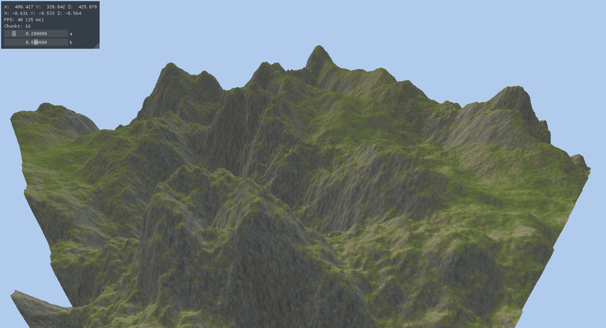

# glterrain

Uses simplex fractal noise to make a heightmap and tesselates it into a mesh. Uses OpenGL 3.

Dependencies:
* OpenGL
* GLEW
* GLFW
* SOIL

Uses:
* [FastNoise](https://github.com/Auburns/FastNoise)
* [Imgui](https://github.com/ocornut/imgui)

Screenshot:

TODO:
* ~~Add basic chunking~~
* Fix normals at chunk boundaries
* Implement dynamic chunking based on camera location
* Implement simple LOD (Level of Detail) based on camera distance
* Implement frustum culling of chunks
